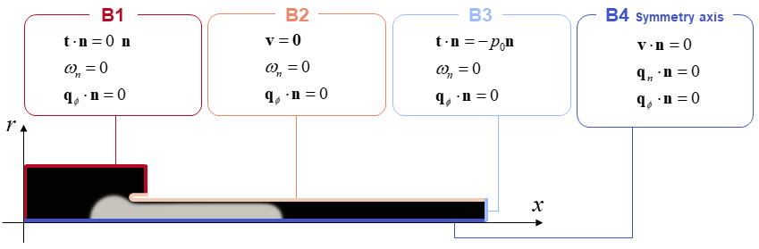

# A mathematical model for two-phase flow in confined environments: numerical solution and validation

This repository serves as the supplementary material of Sciumè et al.[^1]. Specifically, it contains two python files to compute the two cases of Section  4.1. *Capillary extraction of an oil droplet at the extremity of a glass tube*):
- $\mu_n=1Pa.s$: Oil_droplet_1.py 
- $\mu_n=5Pa.s$: Oil_droplet_5.py

## Description of the problem:
The codes of this repository aim in reproducing the capillary extraction of a non-wetting oil droplet realised in Piroird, et al.[^2], coupling a Can-Hillard and a Stokes formulation to account for the interface. The oil droplet placed in a glass tube of radius Rt = 0.88 mm and length Lt = 40 mm, fully immersed in a mixture of water and ethanol of the same density: when the droplet is placed at the left extremity of the tube, a slight perturbation results in its complete extraction.

## Boundary conditions

Boundary conditions needs to complete the requirements of both Can-Hillard and Stokes models.[^1]



For the Stokes system we have 4 types of boundary conditions for the 4 bounds B1, B2, B3 and B4:
- on B1 the traction vector $\mathbf{t}$ is null;	
- on B2, which corresponds to the surface of the glass tube, the velocity vector is set null (no-slip condition);
- on B3, which corresponds to the left extremity of the tube in Figure \ref{fig:oil_extraction_2}, an over-pressure (pressure perturbation) $p_0 = 2$ Pa is assumed;
- on B4 the axial-symmetry of the problem is accounted by setting the velocity component $v_r = 0$ m/s.


Note that the value of the pressure on B3 is relatively small and has only the role to trigger oil extraction. Once the extraction initiates the dynamics is then governed by the interfacial tension and the over-pressure on B3 has a negligible impact.
For the Cahn-Hilliard system we have two types of boundary conditions:
- on the boundary B1 $\cup$ B2 $\cup$ B3 a natural condition is assumed for the chemical potential (the gradient of the chemical potential is set null) while a non-wetting condition is assumed for the mass fraction of oil;
- on B4 the boundary condition respect the axial-symmetry of the problem (natural conditions are assumed for both the chemical potential and the mass fraction of oil).

## Mechanical parameters

| Parameter                                         | Symbol         | Value               | Unit                          | Source              |
|---------------------------------------------------|----------------|---------------------|-------------------------------|---------------------|
| Interfacial tension between the fluid phases      | $\sigma_{nw}$  | 0.02                | N/m                           | Piroird (2011)      |
| Dynamic viscosity of the water-ethanol solution   | $\mu_w$        | 0.001               | Pa·s                          | Piroird (2011)      |
| Density of the water-ethanol solution             | $\rho_w$       | 960                 | kg/m³                         | Piroird (2011)      |
| Dynamic viscosity of the silicone oil             | $\mu_n$        | 1; 5                | Pa·s                          | Piroird (2011)      |
| Density of the silicone oil                       | $\rho_n$       | 960                 | kg/m³                         | Piroird (2011)      |
| Mobility of the interface                         | $M$            | $4 \times 10^{-9}$  | m⁵/(s·J)                      | Identified          |


## FEniCS Versions
The following docker environment can be used to run the model ([pymor/fenics_py3.9](https://hub.docker.com/r/pymor/fenics_py3.9)):
```cmd
docker run -ti -v $(pwd):/home/fenics/shared -w /home/fenics/shared pymor/fenics_py3.9 bash
```

If you use the docker environement, to avoid an error in the export method please change:
```python  
file0 = File("pipette_case3/potential.pvd",    "compressed")
```
to 
```python  
file0 = File("pipette_case3/potential.pvd")
```

## References 
[^1]: *Sciumè et al*, A mathematical model for two-phase flow in confined environments: numerical solution and validation

[^2]: *Piroird et al*, [Capillary extraction.](https://pubmed.ncbi.nlm.nih.gov/21662237/)